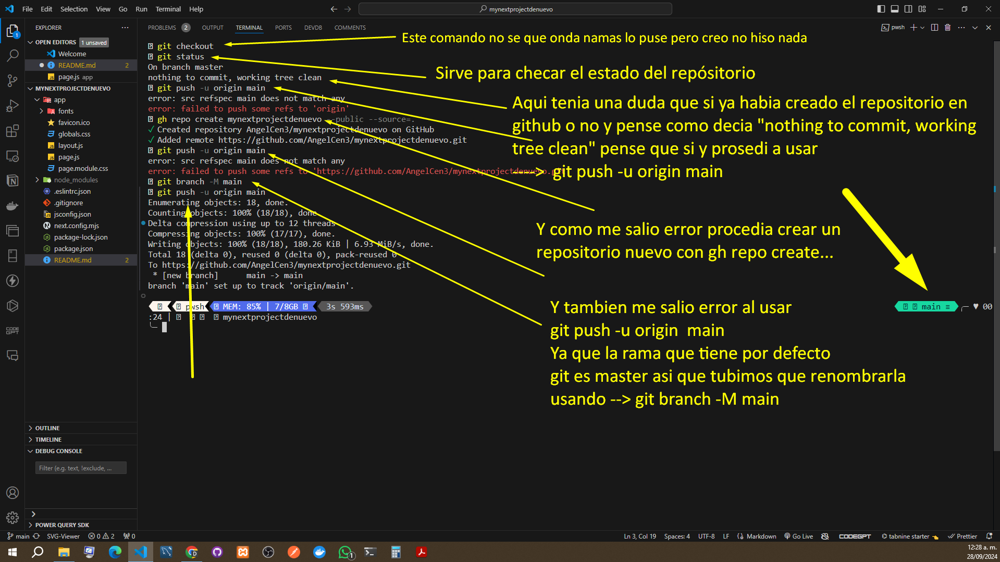
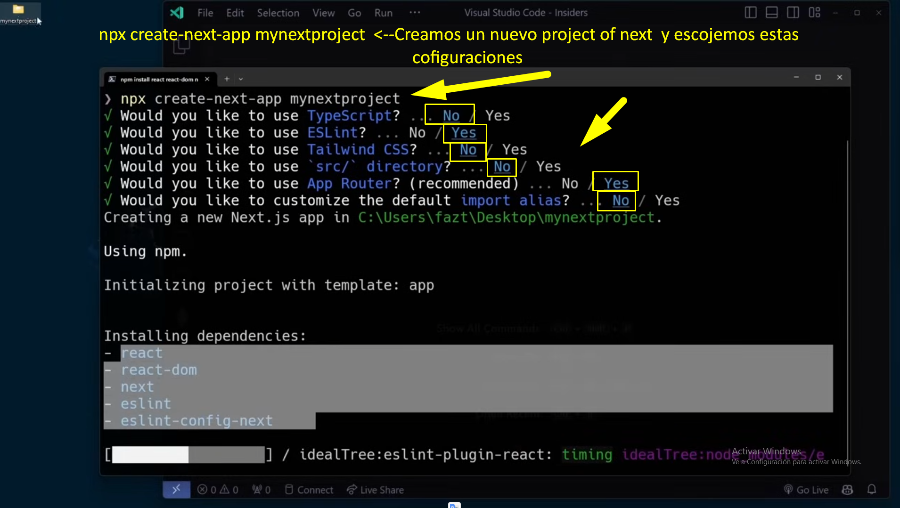
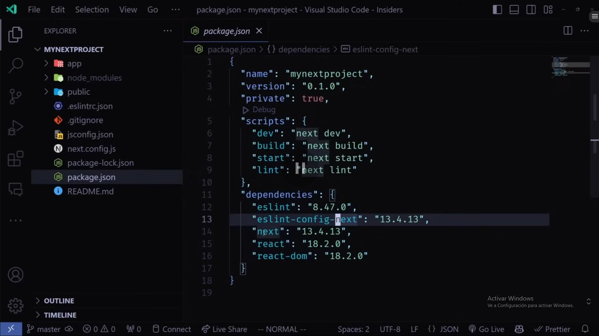
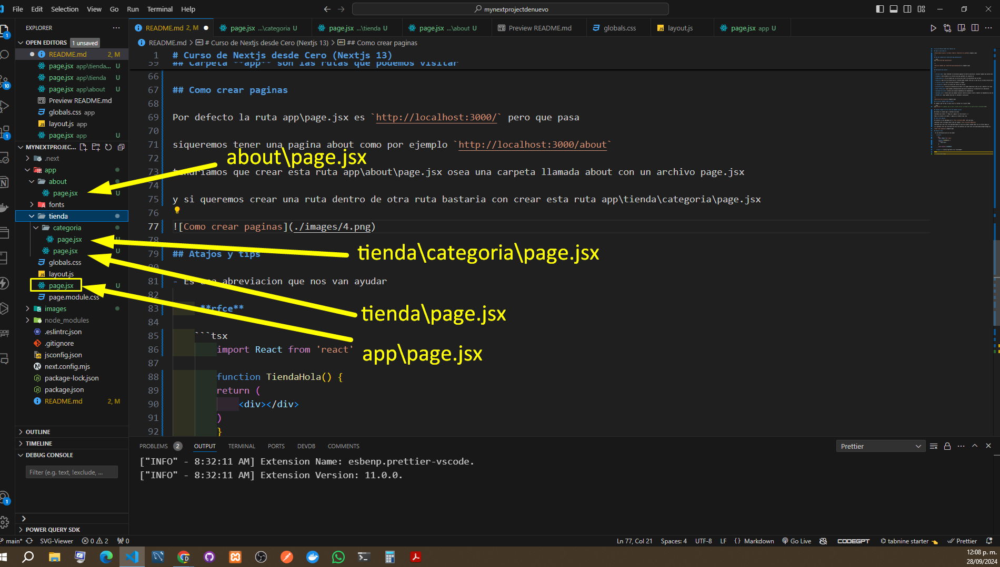
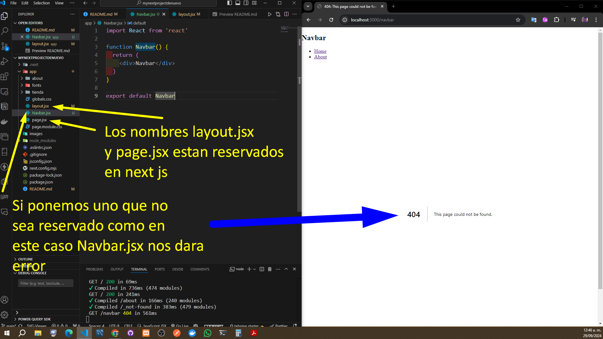
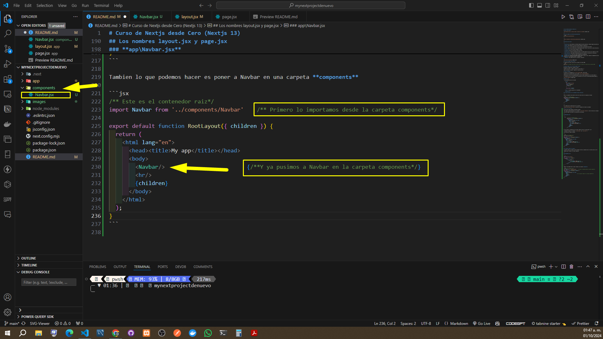
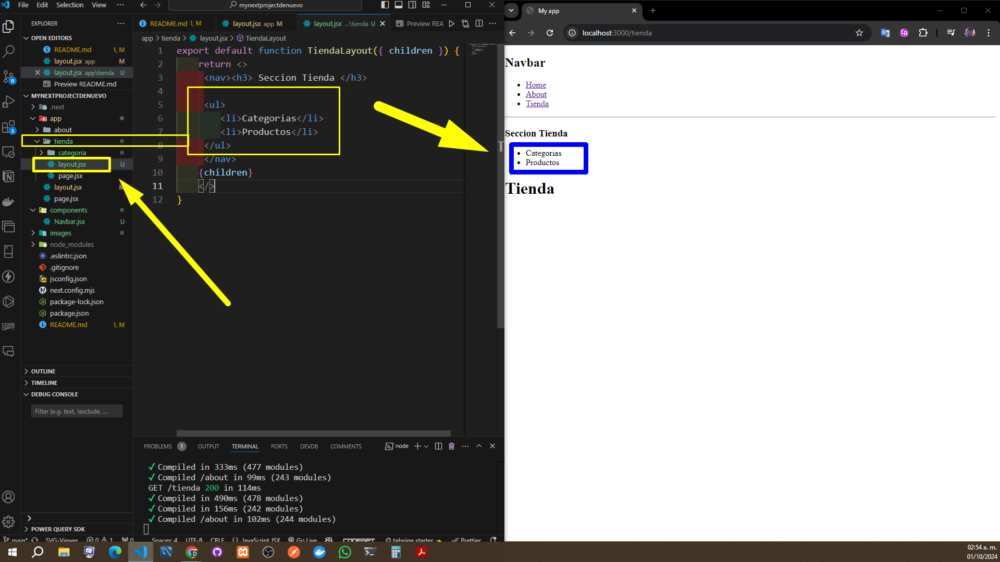

# Curso de Nextjs desde Cero (Nextjs 13)

## Aqui lo que vemos es



---

## Uso del comando npx create-next-app mynextproject

```bash
npx create-next-app mynextproject
```

---



---

## Extructura del project

---

- **Carpeta App**: Aqui tendremos las multiples paginas de nuestra aplicacion, cualquier pagina que quieras que se vea aqui ira

- **images**: Esta carpeta yo la cree por que aqui guardare las capturas de

- **node_modules**: Es una carpeta que se utiliza para tener las bibliotecas que usa Next

- **public**: aqui van los archivos que el frontend puede acceder (Pero por lo que veo en la nueva version del project no aparece)

- **.eslintrc.json**: Esto sirve para formatear el codigo

- **.gitignore**: Este es un archivo del control de version

- **jsconfig.json**: Archivo de configuracion de Next js se puede especificar como se van a importar las rutas

- **next.config.mjs**: Aqui ponemos configuraciones para que se ejecute en la ejecucion de la aplicacion

- **package-lock.json**: Archivo para manejar dependencias de dependencias

- **package.json**: Archivo para que podamos ejecutar nuestros propios script y tambien las dependencias que usamos para que al descargarlo de la nube podamos descargar las dependencias

- **README.md**: Aqui podemos describir el documento o aplicacion

---



## El uso del command **npm run dev**

El command _npm run dev_ es para correr un sevidor en el puerto 3000

```bash
npm run dev # El command _npm run dev_ es para correr un sevidor en el puerto http://localhost:3000/
```

## Carpeta **app** son las rutas que podemos visitar

Borraremos la carpeta app y crearemos una nueva

Crearemos una archivo --> Page.jsx y page es la ruta inicial (./)

Todos los archivos con nombre -> page.jsx se tomaran como ruta

## Como crear paginas

Por defecto la ruta app\page.jsx es `http://localhost:3000/` pero que pasa

siqueremos tener una pagina about como por ejemplo `http://localhost:3000/about`

tendriamos que crear esta ruta app\about\page.jsx osea una carpeta llamada about con un archivo page.jsx

y si queremos crear una ruta dentro de otra ruta bastaria con crear esta ruta app\tienda\categoria\page.jsx



## Atajos y tips

- Es una abreviacion que nos van ayudar

    -**rfce**

    ```tsx
        import React from 'react'

        function TiendaHola() {
        return (
            <div></div>
        )
        }

        export default TiendaHola
    ```

    -**cgl** --> console.log("Este es el resultado0")

    -**shift+Alt Gr**

## El archivo layout.js es el contenedor de toda la aplicacion

---

Como es un componente resive promts en este caso clildren osea son las paginas que creamos

```jsx
/** Este es el contenedor raiz*/
export default function RootLayout({ children }) {
  return (
    <html lang="en">
      <body>
        {children}
      </body>
    </html>
  );
}
```

---

En el ejemplo que nos proporciona next no nos aparace

`<head><title>My app</title></head>` ya que Next lo agrega de otra manera con metadata

## ----------------> Link

En esta seccion vamos aprender como cambiar de pagina

-Para cambiar de pagina podriamos usar la etiqueta `<a href="http://>About</a>` pero esto hace que se recargue la pagina.

y esto NO ES IDEAL ya que React es una aplicacion side rendering

---

## **app\layout.jsx**

---

```jsx
          /** Este es el contenedor raiz*/
          export default function RootLayout({ children }) {
            return (
              <html lang="en">
                <head><title>My app</title></head>
                <body>
                  <nav><h1>Navbar</h1>
                  <ul>
                    <li><a href="/">Home</a></li>
                    <li><a href="/about">About</a></li>
                  </ul>
                  </nav>
                  {children}
                </body>
              </html>
            );
          }
```

Asi que usaremos un componente que nos da Next llamado y para eso lo vamos import-> Link

y simplemente remplaza a la etiqueta `<a href="http://` por `<Link href="/">`

y esto hace que no cambie la pestaña

---

```jsx
/** Este es el contenedor raiz*/
import Link from 'next/link'

export default function RootLayout({ children }) {
  return (
    <html lang="en">
      <head><title>My app</title></head>
      <body>
        <nav><h1>Navbar</h1>
        <ul>
          <li><Link href="/">Home</Link></li>
          <li><Link href="/about">About</Link></li>
        </ul>
        </nav>
        {children}
      </body>
    </html>
  );
}
```

## Los nombres layout.jsx y page.jsx

Los nombres layout.jsx y page.jsx estan reservados en Next asi cualquiera que no se llame asi dara un error

-Podemos poner el Navbar en su propio componente

---



### **app\Navbar.jsx**

---

```jsx
import Link from 'next/link'

export default function Navbar() {
    return (
        <div>
            <nav><h1>Navbar</h1>
                <ul>
                    <li><Link href="/">Home</Link></li>
                    <li><Link href="/about">About</Link></li>
                </ul>
            </nav>
        </div>
    )
}
```

## Crear una carpeta **components**

---

Tambien lo que podemos hacer es poner a Navbar en una carpeta **components** esto permitira tener el codigo mas organizado

---

```jsx
/** Este es el contenedor raiz*/
import Navbar from '../components/Navbar'    /** Primero lo importamos desde la carpeta components*/

export default function RootLayout({ children }) {
  return (
    <html lang="en">
      <head><title>My app</title></head>
      <body>
        <Navbar/>                         {/**Y ya pusimos a Navbar en la carpeta components*/}
        <hr/>
        {children}
      </body>
    </html>
  );
}
```



## Layout

NextJS nos permite crear multiples **layouts** por ejemplo aqui lo que hicimos es poner una subanvegacion dentro de la carpeta tienda lo que hace que solo **Tienda** tenga esta layout

---



## Metadata

NextJS hace que lo que hace que pueda ser interactivo


